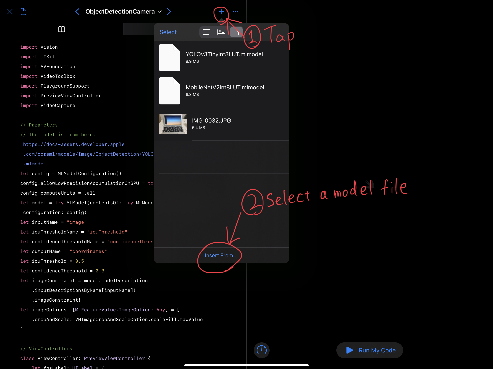

# coreml-playground

CoreML examples for Swift Playgrounds 3.1 on iPadOS 13.1 or later

## Get Started

[Subscribe to the feed on your iPad](https://developer.apple.com/ul/sp0?url=https://kebo.xyz/coreml-playground/feed.json)

Before you run the code, make sure that your model file is imported.

## Supported models

1. Object Recognition
    - [MobileNetv2](https://developer.apple.com/machine-learning/models/)
    - [Resnet50](https://developer.apple.com/machine-learning/models/)
    - [SqueezeNet](https://developer.apple.com/machine-learning/models/)
1. Object Detection
    - [YOLOv3-Tiny](https://developer.apple.com/machine-learning/models/)
    - [MobileNetV2+SSDLite](https://machinethink.net/blog/mobilenet-ssdlite-coreml/)
    - ~~[YOLOv3](https://developer.apple.com/machine-learning/models/)~~ (insufficient memory)
